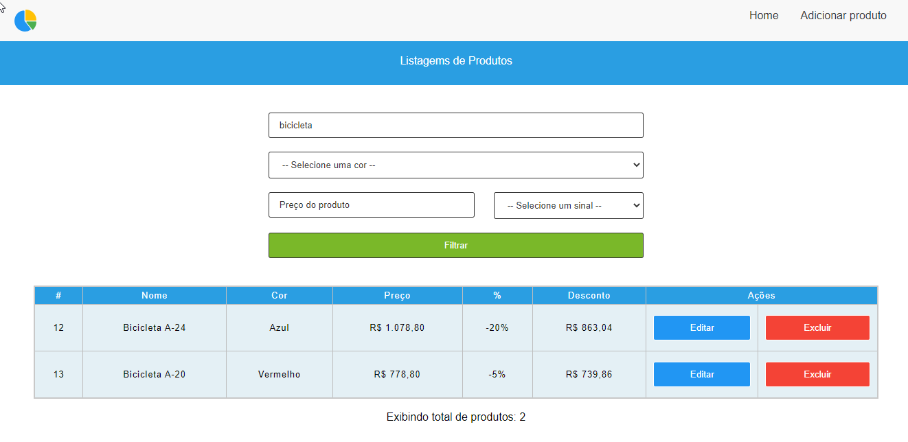

<p align="center" id="top">
    
</p>

<h1 align="center"> Catálogo de Produtos com PHP</h1>

<p align="center">
    <a href="#sobre">Sobre</a> • 
    <a href="#features">Features</a> • 
    <a href="#demo">Demo</a> • 
    <a href="#pre-requisitos">Pré-requisitos</a> • 
    <a href="#tecnologias">Tecnologias</a> • 
    <a href="#licenca">Lincença</a> • 
    <a href="#autor">Autor</a> 
</p>

### Sobre

Catálogo de produtos é uma aplicação web feito com o [PHP](https://www.php.net/). Nessa aplicação foi realizado na prática os principais conceitos de Programação Orientada a Objetos POO. Realizando um CRUD completo com [PDO](https://www.php.net/manual/pt_BR/book.pdo.php) (PHP Data Objects) que é um módulo de PHP montado sob o paradigma Orientado a Objetos, cujo objetivo é prover uma padronização da forma com que PHP se comunica com um banco de dados relacional.

### Caracteristicas principais

- [x] Cadastro de produtos
- [x] Editar produtos
- [x] Deletar produtos
- [x] Listagem de produtos
- [x] Cálculo de descontos dos produtos
- [x] Filtro

### Demo
<h1 align="center">
    
</h1>

<p align="right">
<sub>(Preview)</sub>
</p>

### Pre-requisitos

Antes de começar, você vai precisar ter instalado em sua máquina as seguintes ferramentas: [Git](https://git-scm.com/), [Composer](https://getcomposer.org/), [PHP](https://www.php.net/), [MySQL](https://www.mysql.com/). Além disto é bom ter um editor para trabalhar com o código como [VsCode](https://code.visualstudio.com/)

### 👨🏻‍💻 Rodando o Back End

#### Clone este repositório

```bash
git clone https://github.com/JuniorLima22/titansoftware.git
```

#### Acesse a pasta do projeto no terminal/cmd

```bash
cd titansoftware
```

#### Instale o autoload

```bash
composer install
```

### 💾 Rodando o Banco de Dados

```bash
# Configure suas variáveis ​​de banco de dados em App\Db\Database.php

# Executar o script SQL em database/banco_tabelas.sql para criar o banco de dados 'titansoftware' e as tabelas 'Produtos' e 'Precos' e popular os dados.

# ⮮ OU ⮯

# Criar um novo esquema no Banco de Dados MySql

# Executar o script SQL em database/tabelas_produtos_precos.sql para criar as tabelas 'Produtos' e 'Precos' e popular os dados.

# Execute a aplicação no servidor local <http://localhost>
```
### Tecnologias

As seguintes ferramentas 🛠 foram usadas na construção do projeto:

<table>
    <tr>
        <td><a href="https://www.php.net/">PHP</a></td>
        <td><a href="https://getcomposer.org/"> Composer</a></td>
        <td><a href="https://www.mysql.com/">MySql</a></td>
        <td><a href="https://www.google.com/search?q=html5">HTML</a></td>
        <td><a href="https://www.google.com/search?q=css3">CSS</a></td>
        <td><a href="https://git-scm.com/">Git</a></td>
    </tr>
    <tr>
        <td>7.4.*</td>
        <td>2.0.*</td>
        <td>5.3.*</td>
        <td>5</td>
        <td>3</td>
        <td>2.*</td>
    </tr>
</table>

### Licenca

O catálogo de produtos é um software de código aberto licenciado sob a [MIT license](http://opensource.org/licenses/MIT).

### Wakatime
Tempo gasto no IDE para este repositório, rastreado automaticamente com [wakatime](https://wakatime.com/) .

[](https://wakatime.com/badge/github/JuniorLima22/titansoftware)

### Autor

> Made with 💙 by JUNIOR LIMA 👋 <a href="https://www.linkedin.com/in/JuniorLima22/" target="_blank">See my LinkedIn</a> • GitHub <a href="https://github.com/JuniorLima22" target="_blank">@JuniorLima22</a>

<p align="center">
<sub><a href="#top" align="center">↑ voltar para o topo ↑</a></sub>
</p>